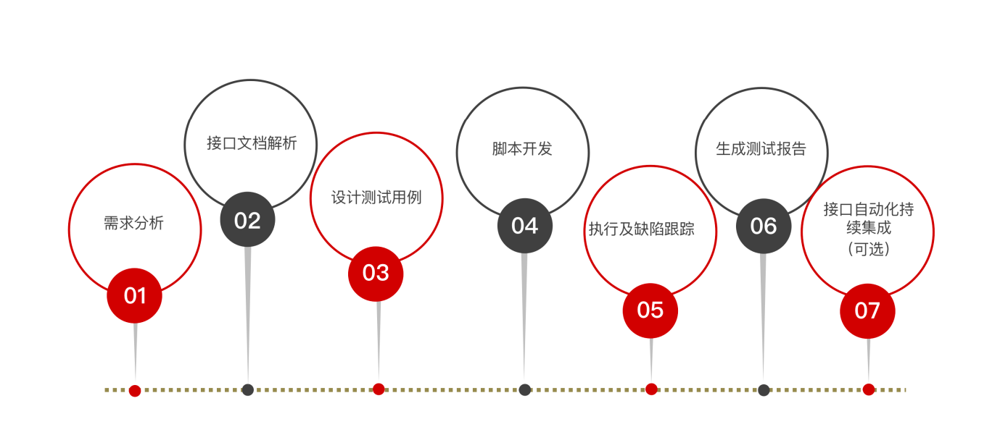

1、规范接口测试流程、接⼝测试⽤例设计⽅法（功能测试：单接口用例、业务场景用例；性能测试：响应时间、吞吐量、错误率、服务器资源使用率）、测试报告生成；

2、接⼝测试脚本编写：python（Request库、UnitTest框架、接口对象封装）；postman（JS断言、接口关联、参数化）；

3、接口测试数据库操作：PyMySQL增删改查、数据库操作类封、工具类封装；

4、接口测试自动化框架封装，生成测试报告、logging日志收集、jsonschema库全量字段校验；

5、接口测试：Jenkins持续集成（postman、代码），Dubbo接口自动化框架；

6、性能测试：Jmeter工具全面使用（参数化、断言、关联、分布式等）、Locust分布式负载框架使用；

# 1、规范接口测试流程

1. 需求分析（产品经理的需求⽂档）
2. 接⼝⽂档解析（开发编写的 接⼝API⽂档）
3. 设计 接⼝测试⽤例（编写 Excel 表格形式的⽤例）
4. 准备接⼝测试脚本
postman ⼯具 ⽣成脚本
python 代码 编写脚本
5. 执⾏测试⽤例，跟踪缺陷
6. ⽣成 接⼝测试报告
7. 接⼝⾃动化持续集成（可选）

接⼝⽂档解析 

什么是接⼝⽂档 

也叫 API ⽂档，⼀般由 后端开发⼯程师编写。⽤来描述 接⼝信息的 ⽂档。 

接⼝⽂档的作⽤ 

协同：团队⼈员⼯作协同配合 

约束：项⽬更新修改同步维护 

解析接⼝⽂档 

为什么要解析 

通过分析接⼝⽂档，熟悉接⼝信息。 

通过接⼝⽂档获取，接⼝测试所使⽤的 请求数据、预期结果。 

解析的核⼼⽬标 

1. 请求报⽂关键数据 
   1. 请求⽅法、URL、请求数据（请求头、请求体） 
2. 响应报⽂关键数据
   1. 响应状态码、响应数据（响应体）

# 2、规范接口用例设计

## 接⼝测试的测试点

- 功能测试 单接⼝功能测试： ⼀个单独的业务，就对⼀个独⽴的接⼝。如：登录业务，对应登录接⼝。 业务场景功能测试： 多个接⼝被连续调⽤。（模拟⽤户的实际使⽤场景） 

- 性能测试 响应时⻓：从发送请求到接收到服务器回发响应包所经历的时间。 错误率：服务器运⾏出错的概率 吞吐量：服务器单位时间内，处理请求的数量。 服务器资源利⽤率：cpu、内存、⽹络、磁盘等 硬件资源的占⽤率。
- 安全测试 攻击安全：⽊⻢、病毒... 由具备专业安全技术，会使⽤专业安全测试⼯具的 安全测试⼯程师 负责。 业务安全： 必须登录，才能访问 ⽤户数据。 敏感数据加密存储。

单接⼝测试用例

业务场景测试⽤例

接口测试可以对单接口以及多个接口关联的业务场景进行测试。

# 软件安装

## postman

postman插件newman

npm install -g newman

再安装newman-reporter-htmlextra

npm install -g newman-reporter-htmlextra

## Jenkins

java -jar jenkins.war 启动 jenkins

localhost:8080 访问 jenkins。

输⼊⽤户名：“admin” 密码：“123456”。登⼊，看到欢迎⻚⾯

开启邮箱POP3/SMTP服务

